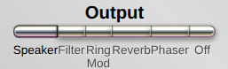
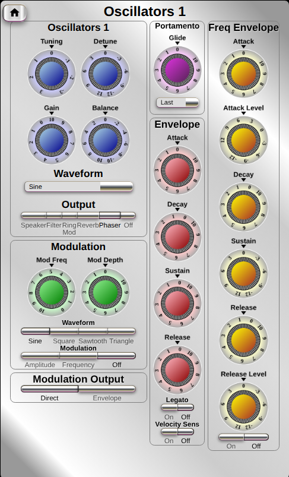
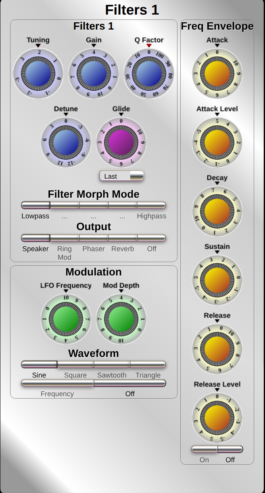
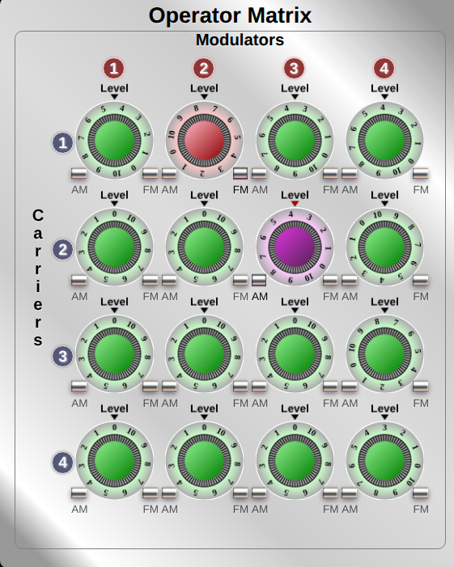
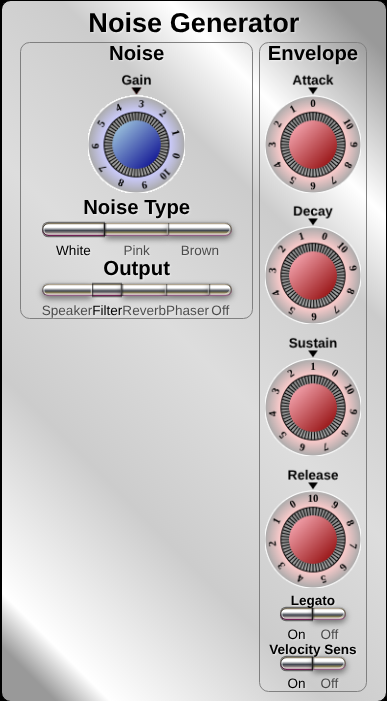
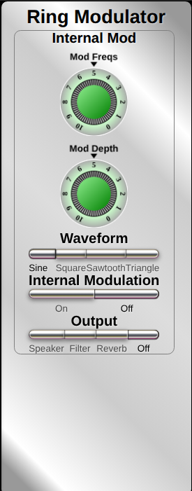
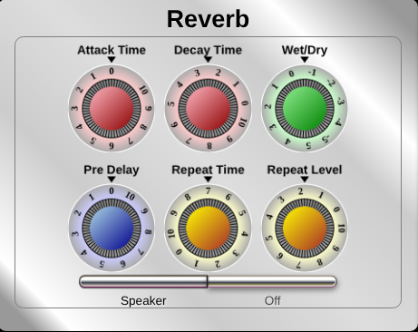
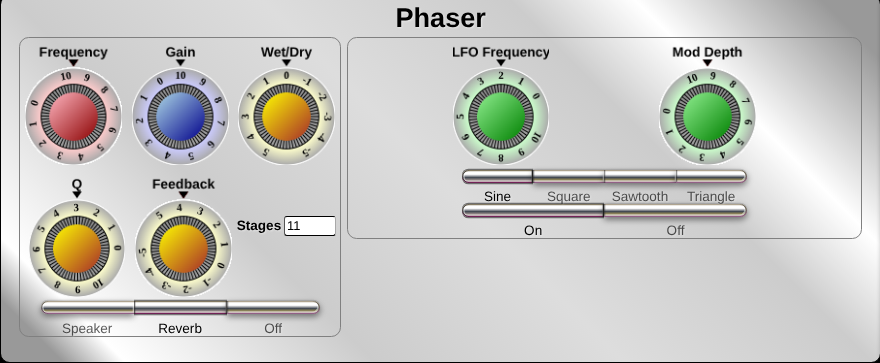
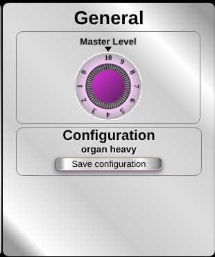

# FM Music Synthesiser
This is a polyphonic music synthesiser which uses features of traditional subtractive synthesis 
using harmonics-rich waveforms run through filters, as well as additive synthesis using FM, or AM modulation.

The synthesiser is a web application using WebAudio. Most of the functionality is in a single audio worklet containing the following:-

* 4 banks of 12 oscillators (for up to 12 note polyphony),
* 4 banks of 12 filters which can be morphed between low and high pass with variable Q. Oscillators each feed into a corresponding filter
 with so that the filter effect on each note is consistent.
* Operator Matrix which enables any oscillator bank to modulate any other, including themselves.
* Phaser which can have between 1 and 61 all pass stages,and has feedback, Q and wet/dry control
* Noise generator which can produce white, pink or brown noise.
* ADSR envelopes for oscillator banks and noise generator.
* Pitch envelope for oscillator banks and filter
* Portamento for oscillator and filter banks 
* Modulator for Oscillator and filter banks (variable between LFO and audio frequencies).
* LFO for Phaser

The audio worklet uses a WebAssembly compiled from C code with Emscripten. 

Additional modules are:-

* Reverb unit which comprises a convolver with settable echo attack and decay times and a repeat echo
loop with variable delay and pre-delay.
* Ring modulator.
* Analyser with a graphical display which can show the audio in the time (oscilloscope) or frequency
(spectrum analyser) domains.
 

* It will work with standard USB MIDI keyboards.

The synthesiser may be either run in a browser, or built as an application for Linux or Windows as Electron Desktop apps.

*The Complete synthesiser control panel*
## Building the project for installation on Linux (Debian/Ubuntu) or Windows

1. Download from GitHub (git clone git@github.com:richard-austin/synthesiser.git))
2. cd to project directory
3. cd to client and type npm install
4. cd to electron-desktop and type npm install (on Linux dev environment only)
5. cd to electron-desktop-win and type npm install. (on Windows dev environment only) (these npm install steps only need to be done
on initial set up or if any node modules are changed/added/updated.)
### To build a Windows installer (amd_64)
1. *This must be done from a Windows environment*
2. cd to the project directory 
3. Type ./gradlew electron-desktop-win:buildWindows
#### The installer file will be at projectDir/electron-desktop-win/dist with a name similar to synthesiser-desktop-win Setup 1.0.0.exe
### To build a Debian deb installation file (amd_64)
1. *This must be done from a Linux environment.*
2. cd to project directory
3. Type ./gradlew electron-desktop:buildLinux
#### The installer file will be at projectDir/electron-desktop/dist with a name similar to synthesiser-desktop_1.0.0.deb

## Using the synthesiser

### The control dials
The most ubiquitous object on the main panel are the control dials.

* To increase or decrease the setting on a control dial, hold the mouse button down and drag up to increase the setting, down to decrease it.
* To set a dial to zero, click on it then press ESC.
* To set a dial to a particular number on the dial, click on the dial so the cursor above it turns red and press F*n* where *n* is the required number. 
* Some of the dials have negative settings, To go straight to these, click on the dial so the cursor above it turns red then press the shift key along 
with the appropriate F key. 

### Selecting oscillator/filter banks.
Each bank of oscillators has a corresponding bank of filters. When keys are pressed on the keyboard
a vacant oscillator is selected to play that note* At the same time the filter selected from the 
corresponding bank will be the filter that corresponds to that oscillator, and it will be assigned the same base frequency
as the oscillator.

\* If an oscillator is still actively playing a note just played again (i.e. during the release phase of the envelope)
It will be selected again ahead of any vacant oscillators and retriggered on that note.

* On the Operator Matrix panel, an oscillator/filter bank pair can be selected by clicking on the number of the bank you want 
In either the carriers column or modulators row. 

*The operator modulation matrix*

### Module Outputs

Each module has a set of output selector buttons which determine where the output from that module will go to.
The speaker is selected on illustration. 
These are the oscillator output buttons which enable directing the oscillator output to the speaker, filter, 
ring modulator, reverb, phaser or having it set off. Note for the oscillators and filters, each
bank has its own output setting independent of the others.

### Oscillators
There are 4 banks of 12 oscillators giving up to four simultaneous settings with 12 note polyphony on each bank.

*Oscillator bank 1*

#### Main Controls

| Control  | Function                                                                                                                                                                                                                           |
|----------|------------------------------------------------------------------------------------------------------------------------------------------------------------------------------------------------------------------------------------|
| Tuning   | Centered on zero where middle C will be in the expected place, this tunes the frequency up or down from nominal by up to 3 octaves. The dial numbers represent octaves up or down The resolution of course is finer than octaves. |
| Detune   | Centred on zero where there is no offset, the dial scale allows detune by up to + or - 12 semitones                                                                                                                                |
| Gain     | Set the output level to between zero and 100% of full output.                                                                                                                                                                     |
| Balance  | Adjust the left/right balance of the output. Note that this also applies to the filters in the same bank. The phaser and noise output balance is set by the  balance control on oscillator bank 1.                                 |
| Waveform | This is a drop down control allowing the selection of waveform for the oscillator output                                                                                                                                           |
| Output   | Select output target for the oscillator bank (Sere module outputs above)                                                                                                                                                           |

#### Oscillator Modulation

| Control    | Function                                                                                                                                       |
|------------|------------------------------------------------------------------------------------------------------------------------------------------------|
| Mod Freq   | Frequency of the modulator. This works over a fairly wide range with an exponential law enabling it to range from an LFO to an audio modulator |
| Mod Depth  | Modulation gain                                                                                                                                |
| Waveform   | Select modulation waveform from sine, square sawtooth or triangular waves.                                                                     |
| Modulation | Select type from amplitude, frequency or off (none)                                                                                            |

#### Modulation output

This does not relate to the modulation from the modulating LFO/oscillator described above, but to the output of
the main oscillator when selected as a modulator in the Operator Matrix.

| Setting  | Result                                                                                                                                           |
|----------|--------------------------------------------------------------------------------------------------------------------------------------------------|
| Direct   | The oscillator output is applied for modulation without envelope shaping, i.e. at the contant level selected by the dial on the operator matrix. |
| Envelope | The oscillator output is time dependent as set by the ASDR envelope, with overall modulation gain set by the dial on the operator matrix         |

#### Portamento
This function is limited at the moment, and just gives a glide between the previous note and the next. Set to zero, there is no portamento.
The drop down below it is from an earlier version and currently does nothing.

#### Envelope

This is a standard ADSR envelope shaper.
#### Legato
If legato mode is on, pressing a key will cause the envelope to rise to 100% and remain there for the decay time.
Holding the key down will sustain this. After the decay time has elapsed, the note will tail off in accordance with the release timing.
#### Velocity Sens
Enable/disable velocity sensitivity.
#### Freq Envelope
The pitch envelope is used to bend the pitch over time as the envelope does with output amplitude.
There are two additional controls as compared with the amplitude envelope, Attack Level and Release Level.
When the pitch envelope is set on the sequence is as follows:-
* The pitch starts at the release level when the key is pressed.
* The pitch will change from the release level to the attack level at a rate determined by the attack time. If the key is released before the attack level is reached, the pitch will return to the release level at a rate determined by the release time.
* When the attack level is reached the pitch will then start to change to the sustain level at a rate determined by the decay setting.
* The pitch will remain at the sustain level until the key is released.
* On key release the pitch will change to the release level at a rate determined by the release setting.

The attack, sustain and release levels calibration is such that 3 is + 1 octave -3 is - 1 octave etc.
### Filters
There are four banks of 12 filters, each one in a bank corresponding to the same numbered oscillator in the same bank,
so each oscillator has a single filter tuned proportionally to the corresponding oscillators frequency.

Each of the (total 48) filters is a 4 pole state variable filter which can morph between low and high pass.
They have a Q control which can change the response from fairly flat in the passband to sharply peaking to 
the point of oscillating.

#### Main Controls
| Control  | Function                                                                                                                                                                                                                                                    |
|----------|-------------------------------------------------------------------------------------------------------------------------------------------------------------------------------------------------------------------------------------------------------------|
| Tuning   | Centered on zero where cutoff frequency corresponds to the oscillator frequency at zero, this tunes the frequency up or down from nominal by up to 3 octaves. The dial numbers represent octaves up or down The resolution of course is finer than octaves. |
| Detune   | Centred on zero where there is no offset, the dial scale allows detune by up to + or - 12 semitones                                                                                                                                                         |
| Q Factor | Adjust the sharpness of the peak at cutoff frequency.                                                                                                                                                                                                       |
| Gain     | Set the output level to between zero and 100% of full output.                                                                                                                                                                                               |

#### Portamento
This function is limited at the moment, and just gives a glide between the previous note and the next. Set to zero, there is no portamento.
The drop down below it is from an earlier version and currently does nothing.

#### Filter Morph Mode
Five buttons which set the filter response in steps between low pass and high pass.

#### Output
Five Buttons which are used to set the filter output for the bank to speaker, ring modulator, phaser, 
reverb or off.

#### Filter Modulation

| Control    | Function                                                                                                                                       |
|------------|------------------------------------------------------------------------------------------------------------------------------------------------|
| LFO Frequency   | Frequency of the modulator. This works over a fairly wide range with an exponential law enabling it to range from an LFO to an audio modulator |
| Mod Depth  | Modulation gain                                                                                                                                |
| Waveform   | Select modulation waveform from sine, square sawtooth or triangular waves.                                                                     |
| Modulation | Select type from frequency or off (none)                                                                                            |

#### Freq Envelope
The pitch envelope is used to bend the cutoff frequency over time as the oscillator envelope does with output amplitude.
There are two additional controls as compared with the amplitude envelope, Attack Level and Release Level.
When the pitch envelope is set on the sequence is as follows:-
* The cutoff frequency starts at the release level when the key is pressed.
* The cutoff frequency  will change from the release level to the attack level at a rate determined by the attack time. If the key is released before the attack level is reached, the pitch will return to the release level at a rate determined by the release time.
* When the attack level is reached the pitch will then start to change to the sustain level at a rate determined by the decay setting.
* The cutoff frequency  will remain at the sustain level until the key is released.
* On key release the cutoff frequency  will change to the release level at a rate determined by the release setting.

### Operator Matrix
The operator matrix enables setting any oscillator bank as a modulator for any other oscillator bank, including itself.

*Operator Matrix with oscillator bank 2 frequency modulating bank 1 at level 7.8 and oscillator bank 3 amplitude modulation bank 2 at level 3.9*

When amplitude modulation (AM) is selected, the level dial goes purple and if frequency modulation (FM)
is selected, the dial goes red. To modulate bank A with bank B, select the modulation type (AM or FM) on the control
in row B and column A. Ensure that the carrier bank selected is going to the output you want (click on the modulator or carrier bank
number in the operator matrix to select that bank). You can then press keys and ajust the modulation level for the sound you want.
Modulators don't have to have their output  going anywhere, they will still modulate, but they can optionally be audible themselves.

The relative frequencies of modulators and carriers are important so as not to have a very harsh sounding result!

### Noise Generator

The noise generator is a white, pink or brown noise generator with amplitude envelope controlled output. The outpt
can be to speaker, filter, reverb phaser of off. The amplitude envelope is a standard ADRS envelope as used in the oscillator banks.
When Filter is selected for output, this will be filter bank 1, it cannot connect to other filter banks.

### Ring Modulator

The ring modulator is a AM modulator with the modulation frequency set from a dial and not tracking the oscillator 
banks. This gives rise to dissonant sounds unlike when using the modulation matrix where modulator and carrier track each other.

#### Controls

| Control             | Function                                                                                       |
|---------------------|------------------------------------------------------------------------------------------------|
| Mod Freqs           | Sets the modulation frequency. This frequency is not affected by the Midi keyboard             |
| Mod Depth           | The amplitude of the modulation signal                                                         |
| Waveform            | Select modulating wavefrom from Sine, Square, Sawtooth, or Triangle                            |
| Internal Modulation | Sets the modulating oscillator on or off. When off, no sound will come from the ring modulator |
| Output              | Set where the ring modulator feeds to out of speaker, filter, reverb or off                    |

### Reverb

The reverb unit consists of a convolver and delay module with a variable repeat loop. The two parts work in parallel, so
adjustments to the convolver will not affect the delay line and vice versa. Additionally there is a pre-delay line which
sits in front to the convolver and repeat echo delay line.

The convolver uses a white nose attack and decay cycle as the refence impulse. 

To prevent output from the convolver, set attack time and decay time to zero. To prevent output from the delay line,
set repeat level to zero.

| Control             | Function                                                                                                                                                                       |
|---------------------|--------------------------------------------------------------------------------------------------------------------------------------------------------------------------------|
| Attack Time         | Sets the attack time of the convolver reference impulse.                                                                                                                       |
| Decay Time          | Sets the decay time of the convolver reference impulse.                                                                                                                        |
| Wet Dry             | This applies to both the covolver and delay line. Adjust between fully wet at -5 (all output from convolver and delay line), to fully dry at 5 (all output direct from input). |
| Pre Delay           | The amount of delay on the signal going to the repeat echo line and/or convolver.                                                                                              |
| Repeat Time         | The amount of time between echo repeats                                                                                                                                        |
| Repeat Level        | The level of feedback from the repeat echo loop output back to the input. If set to zero, the output is muted, at 10 the repeat eco continues indefinitely                     |
| Speaker/Off buttons | The output of the reverb unit can either go to the speaker or be off                                                                                                           |

### Phaser

The phaser provides the classic sweeping phasing sound, working best with harmonics-rich sources.  It has a variable number of
stages which can be between 1 and 61,

| Control                       | Function                                                                                                                                                                                                                                                 |
|-------------------------------|----------------------------------------------------------------------------------------------------------------------------------------------------------------------------------------------------------------------------------------------------------|
| Frequency                     | Sets the cutoff frequency of the filter stages. Note that the LFO varies the cutoff frequency between the value set on this control and lower values dependent on the modulation depth.                                                                  |
| Gain                          | The phaser output level.                                                                                                                                                                                                                                 |
| Wet/Dry                       | Mixes the input and filter chain output between all input at -5 and all filter chain output at 5. The strongest phasing effect is at zero where they are equal.                                                                                          |
| Q                             | The Q factor of the filter stages. The higher the Q, the sharper the phase transition will be                                                                                                                                                            |
| Feedback                      | Variable between 5 (full positive feedback where oscillation will occur) zero (no feedback) and -5 (full negative feedback where oscillation will occur)                                                                                                 |
| Speaker/Reverb/Off            | Set the phaser output to the speaker, the reverb unit or off                                                                                                                                                                                             |
| LFO Frequency                 | The LFO gives a continuous up/down sweep of trhe phaser cutoff frequency, LFO frequency sets the rate of this change.                                                                                                                                    |
| Mod Depth                     | The amount oeffect on the cutoff frequency the modulator will have. Note that this LFO only modulates the cutoff fdrequncy **down**. The cutoff frequency will vary between the cutoff set by the FRequency dial down to a level determined by Mod Depth |
| Sine/Square/Sawtooth/Triangle | The LFO waveform.                                                                                                                                                                                                                                        |
| On/Off                        | Sets the LFO on or off.                                                                                                                                                                                                                                  |

### General

