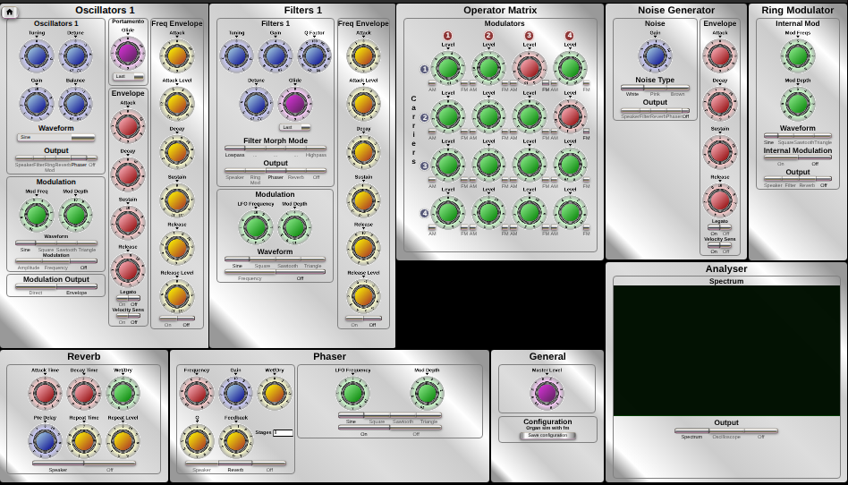
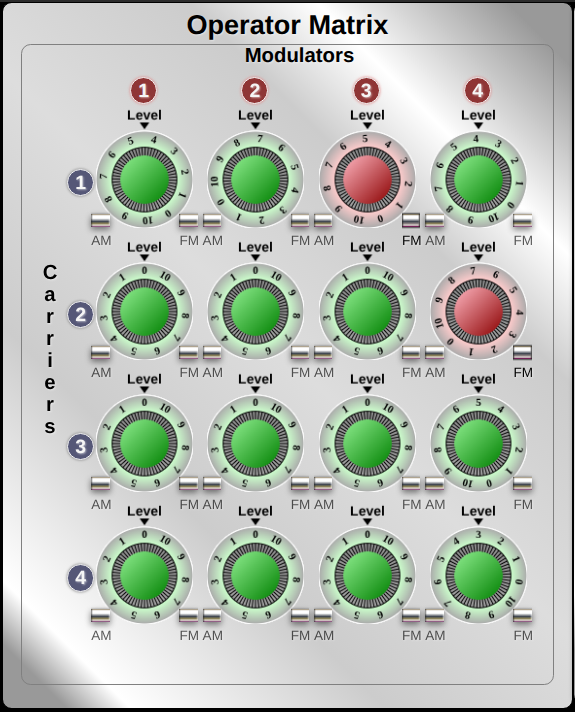

# FM Music Synthesiser
This is a polyphonic music synthesiser which uses features of traditional subtractive synthesis 
using harmonic rich waveforms run through filters, as well as additive synthesis using FM, or AM modulation.

The synthesiser is a web application using WebAudio. Most of the functionality is in a single audio worklet containing the following:-

* 4 banks of 12 oscillators (for up to 12 note polyphony),
* 4 banks of 12 filters which can be morphed between low and high pass with variable Q. Oscillators each feed into a corresponding filter
 with so that the filter effect on each note is consistent.
* Operator Matrix which enables any oscillator bank to modulate any other, including themselves.
* Phaser which can have between 1 and 61 all pass stages,and has feedback, Q and wet/dry control
* Noise generator which can produce white, pink or brown noise.
* ADSR envelopes for oscillator banks and noise generator.
* Pitch envelope for oscillator banks and filter
* Portamento for oscillator and filter banks 
* Modulator for Oscillator and filter banks (variable between LFO and audio frequencies).
* LFO for Phaser

The audio worklet uses a WebAssembly compiled from C code with Emscripten. 

There is also a reverb unit which comprises a convolver with settable echo attack and decay times and a repeat echo
loop with variable delay and pre-delay.

The synthesiser may be either run in a browser, or built as an application for Linux or Windows as Electron Desktop apps.

*The Complete synthesiser control panel* 

*The operator modulation matrix*
